**PROYECTO: PRUEBA TECNICA**

En este ejercicio se asume que existe un modo de administración donde se
configura las tarjetas de crédito a cada usuario, además, la
configuración de los porcentajes de pagos mínimos e intereses
bonificables.

**SCRIPT DE LA BASE DE DATOS**

PruebaTecnica.SQL/PruebaTecnicaScriptDB.sql

**Collection POSTMAN**

PruebaTecnica.SQL/PruebaTecnica.postman_collection.json

**Pantalla Principal**

Muestra el menú principal y la opción para que el usuario ingrese con
sus credenciales además sino las posee permite registrarse.

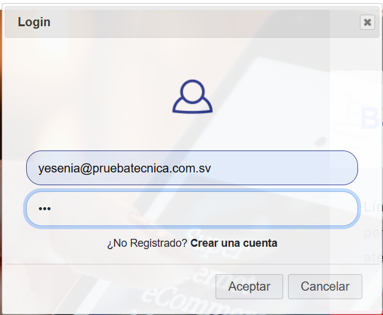

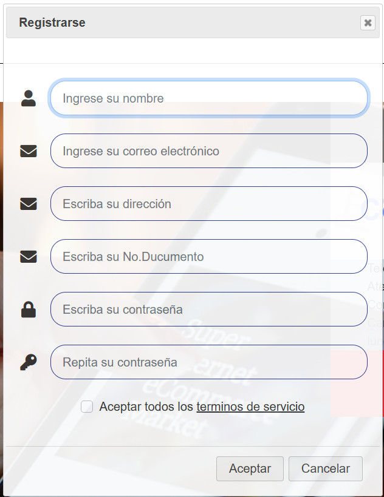

**Pantalla de Contactanos**

Permite al usuario enviar un correo al administrador con el fin de hacer
sugerencias, ya sea para puntos de mejoras en la aplicación o para
reportar errores.

**Pantalla: Acerca de Nosotros**

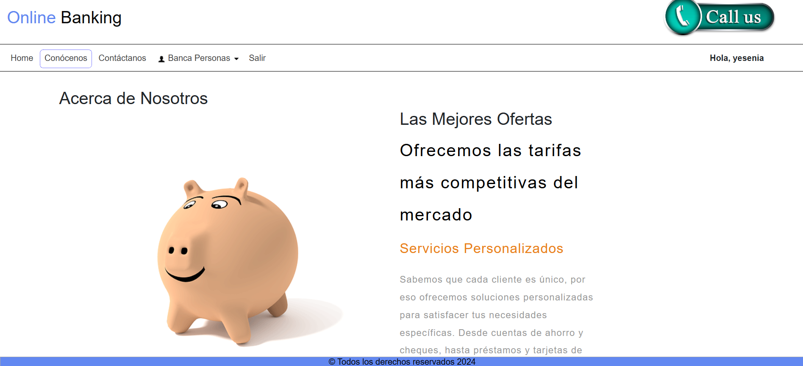

**Pantalla Realizar Compra**

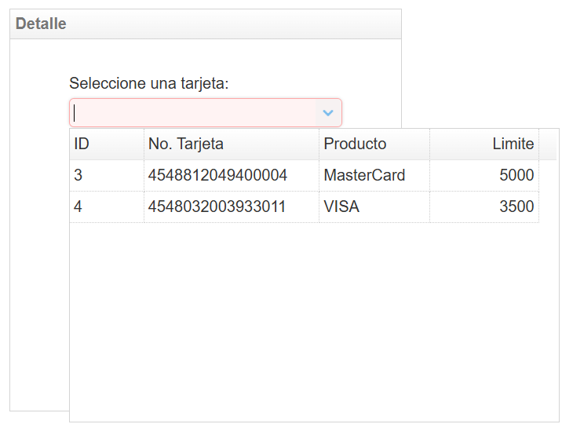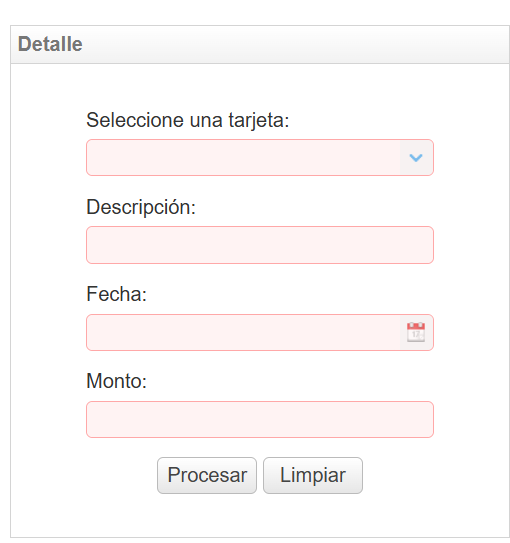

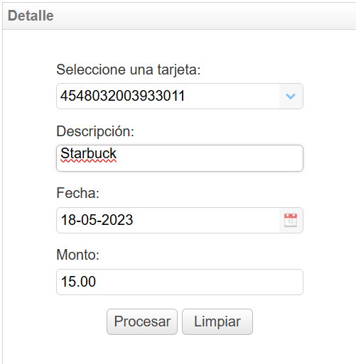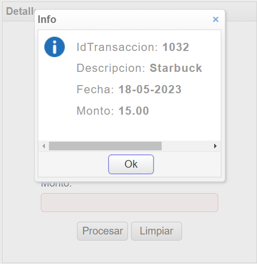

**Pantalla Realizar Pagos**

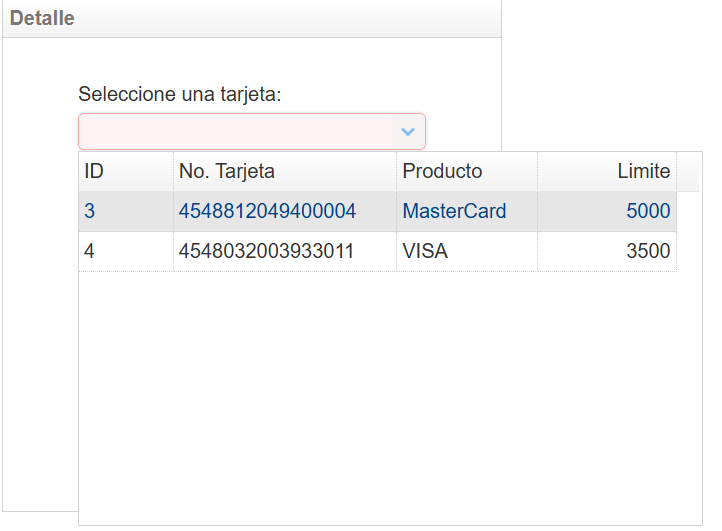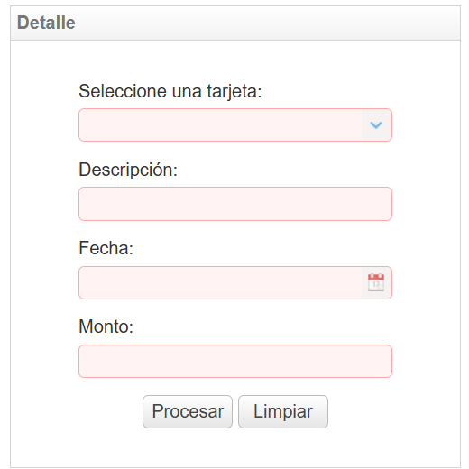

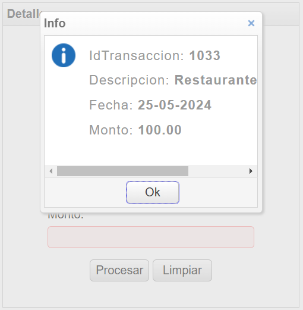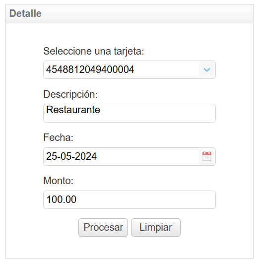

**Pantalla Transacciones**

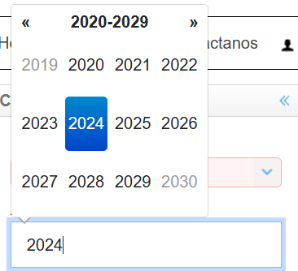

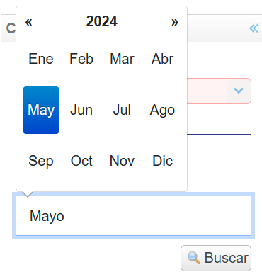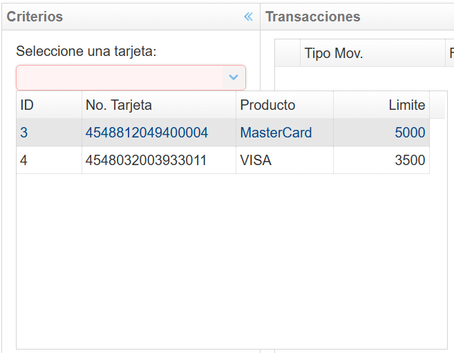

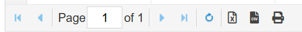

En la barra anterior muestra la exportación a excel, csv, e impresión.

**Pantalla Estado de Cuenta**

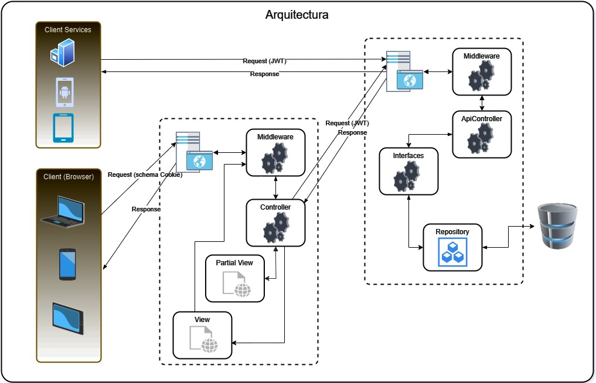

Diagrama Entidad-Relación

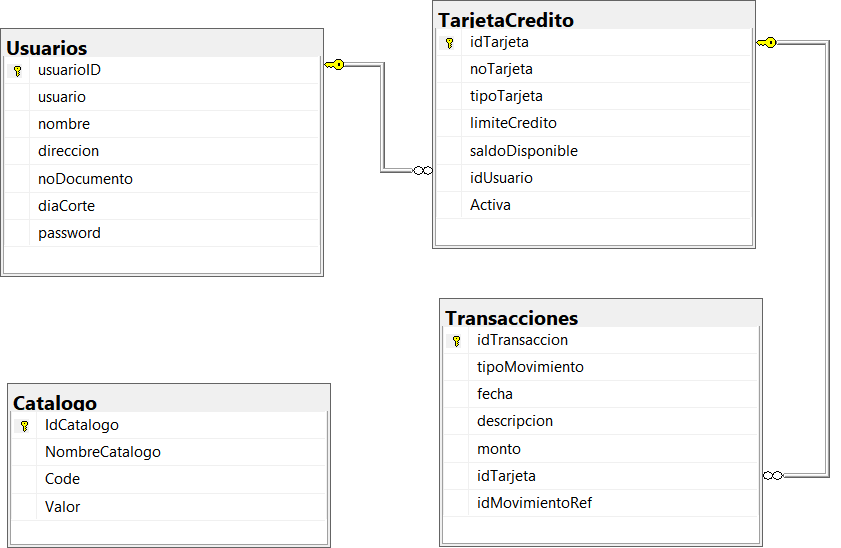
